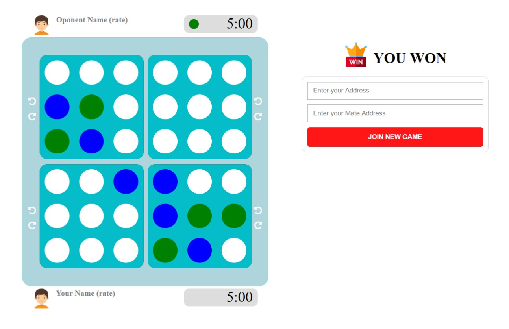

# Xo4

XO-4 is a game originated from Tic Tac Toe (XO) game, but much more exciting and tricky. There exists 4 simple XO sheets (this is where '4' stands for) with rotation capaility. Besides, the winner has to align 5 pieced in row instead of 3. More diagonal alignment possibility will make it more really intellectual game. On the other hand, users will not have infinite time to move. The game has time limitation like chess which defines different time strategies like Blitz, Bullet, etc.

This project was generated with [Angular CLI](https://github.com/angular/angular-cli) version 6.0.8.

## Development server

Run `ng serve` for a dev server. Navigate to `http://localhost:4200/`. The app will automatically reload if you change any of the source files.

## Code scaffolding

Run `ng generate component component-name` to generate a new component. You can also use `ng generate directive|pipe|service|class|guard|interface|enum|module`.

## Build

Run `ng build` to build the project. The build artifacts will be stored in the `dist/` directory. Use the `--prod` flag for a production build.

## Running unit tests

Run `ng test` to execute the unit tests via [Karma](https://karma-runner.github.io).

## Running end-to-end tests

Run `ng e2e` to execute the end-to-end tests via [Protractor](http://www.protractortest.org/).

## Further help

To get more help on the Angular CLI use `ng help` or go check out the [Angular CLI README](https://github.com/angular/angular-cli/blob/master/README.md).
